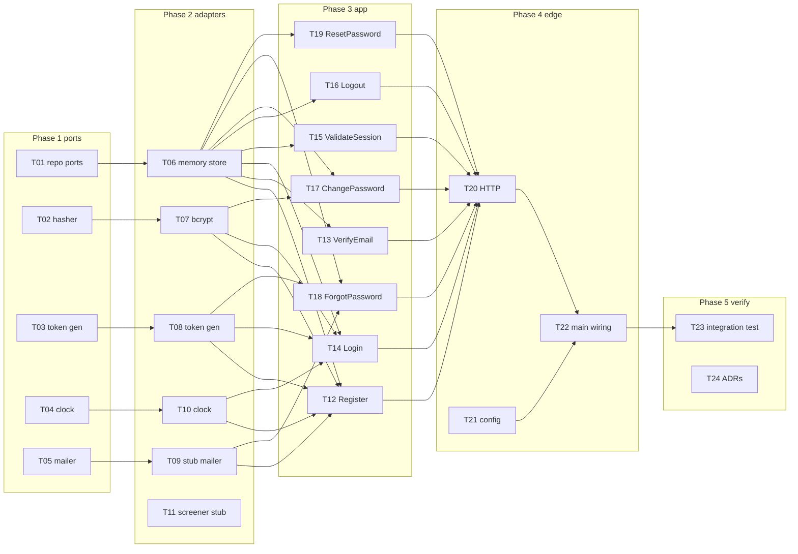

# Implementation Plan — Password-Only Vertical Slice

Goal: make the server **functional end-to-end using only the password credential**.
The domain layer is already built and tested; this plan covers the missing
`port` → `adapter` → `app` → `cmd` layers needed to register, verify, log in,
hold a session, and log out.

This directory is the source of truth for *execution*. Decisions live in
[`../adr/`](../adr/); invariants live in [`../../CLAUDE.md`](../../CLAUDE.md) and
`internal/domain/doc.go`. **Link to those — do not restate them here** (drift risk).

## Locked decisions (2026-06-27)

| Area | Choice | Why |
|------|--------|-----|
| Storage | In-memory (map + mutex) | Fastest path to a functional slice; Postgres is a later swap |
| Password hashing | bcrypt + SHA-256 prehash | ADR 0007; sidesteps bcrypt 72-byte truncation; one dep (`golang.org/x/crypto`) |
| Transport | `net/http` + HttpOnly cookie | Stdlib, browser-friendly, no deps |
| Email/verify | Stub mailer (logs raw token), **verify required before login** | Exercises full register→verify→login path |
| Breach screen | No-op stub for the slice | Real HIBP/dump is post-slice |

## Phases

| Phase | Folder | Layer | Branch | Tasks |
|-------|--------|-------|--------|-------|
| 01 | [`phase-01-ports/`](phase-01-ports/) | `internal/port` | `phase-01-ports` | T01–T05 |
| 02 | [`phase-02-adapters/`](phase-02-adapters/) | `internal/adapter` | `phase-02-adapters` | T06–T11 |
| 03 | [`phase-03-app/`](phase-03-app/) | `internal/app` | `phase-03-app` | T12–T19 |
| 04 | [`phase-04-edge-wiring/`](phase-04-edge-wiring/) | `internal/adapter/http`, `cmd/server` | `phase-04-edge-wiring` | T20–T22 |
| 05 | [`phase-05-verify/`](phase-05-verify/) | tests, `docs/adr` | `phase-05-verify` | T23–T24 |

Live status board: [`STATUS.md`](STATUS.md).

## Dependency graph



**Critical path:** T01→T06 · T02→T07 · T03→T08 → T12–T19 → T20 → T22 → T23.

**MVP cut (login provable):** T01–T04, T06–T08, T10, T12–T16, T20–T23.
T11 stays no-op; T17–T19 deferrable.

## Conventions

### Task file frontmatter

Every `T*.md` starts with YAML frontmatter so an agent can find the next
unblocked task by grep, without reading prose:

```yaml
---
id: T01
phase: 01-ports
title: Repository ports
status: todo            # todo | in_progress | blocked | done
branch: phase-01-ports
layer: internal/port
depends_on: []          # task ids
touches:                # paths the task creates/edits
  - internal/port/repository.go
done_when:              # exit criteria; the last three are MANDATORY on every task
  - tests implemented: <task-specific cases>
  - make check passes (fmt-check, vet, staticcheck, go test -race)
  - make vuln passes
---
```

### Definition of done (every task)

A task may flip to `done` only when all three gates are green — no exceptions for
"trivial" tasks (a one-line adapter still gets a test):

1. **Tests implemented** — code lands with its `*_test.go`. Black-box
   (`package x_test`) where the domain pattern applies; for interface-only port
   tasks, a contract test with fakes + compile-time `var _ port.X = ...` assertions
   counts. Cover the happy path and every rejected input (`errors.Is`).
2. **`make check` green** — fmt-check + vet + staticcheck + `go test -race`. This
   is both the test check and the Go code-quality check.
3. **`make vuln` green** — `govulncheck` clean.

Sole carve-out: a **docs-only** task (e.g. T24) ships no Go code, so it has nothing
for gates 1/3 to cover; it still must pass `make check`. Every task that writes Go
gets all three.

### Workflow

1. Plan (this dir) is committed to `main`.
2. Each phase gets its branch (`phase-0N-...`) cut from `main`.
3. Pick the lowest-id task whose `depends_on` are all `done`.
4. Flip its `status` to `in_progress`, do the work, flip to `done`, update
   [`STATUS.md`](STATUS.md).
5. `make check` + `make vuln` before every commit (CI runs the same).

### Statuses

`todo` not started · `in_progress` active · `blocked` waiting on a dep or a
question · `done` merged + gate green.
